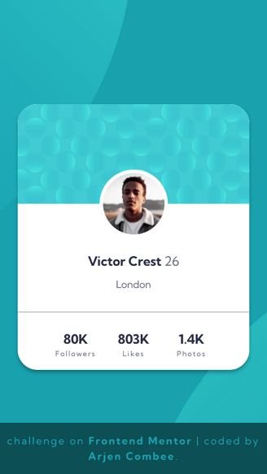

# Frontend Mentor - Profile card component solution

This is a solution to the [Profile card component challenge on Frontend Mentor](https://www.frontendmentor.io/challenges/profile-card-component-cfArpWshJ). Frontend Mentor challenges help you improve your coding skills by building realistic projects.

## Table of contents

- [Frontend Mentor - Profile card component solution](#frontend-mentor---profile-card-component-solution)
  - [Table of contents](#table-of-contents)
  - [Overview](#overview)
    - [The challenge](#the-challenge)
    - [Screenshot of my **Mobile sollution**](#screenshot-of-my-mobile-sollution)
    - [Links](#links)
  - [My process](#my-process)
    - [Built process and methods](#built-process-and-methods)
      - [Tools and applications](#tools-and-applications)
    - [What I learned](#what-i-learned)
  - [Author](#author)
  - [Acknowledgments](#acknowledgments)

## Overview

### The challenge

Frontendmetor made [this](https://www.frontendmentor.io/challenges/profile-card-component-cfArpWshJ) challenge which is rated as an NEWBIE challenge. But for me I wasn't a walk in the park. Espacially if you try to keep the code clean and symatic. Did the research and read about the best practices in webdevelopment 2021. And yes I cheated a little bit and did not stick to all the best pratices, sorry I need more to learn I'm affraid.

### Screenshot of my **Mobile sollution**

This is the screenshot of my solution for the mobile version of the challenge.

### Links

- Solution URL: [GitHub - repository](https://github.com/ArCombee/FEM-REPOSITORY-2021/tree/main/FEM_01-PROFILE_CARD_COMPONENT/04_SHOWCASE)
- GitHub page: [GitHub - Pages](https://arcombee.github.io/fem/01_profile_card)
- Live Site URL: [My personal site](https://arjencombee.nl/fem/01_profile_card/)

## My process

### Built process and methods

- Semantic HTML5 markup
- CSS custom properties
- Mobile-first workflow
- Flexbox

#### Tools and applications

- VSCode
- Mozzila Firefox Developer
- Google Chrome

### What I learned

This is my first challenge on Frontend Mentor. So I learned a lot of new stuff. I tried to code different versions, with different approches. This is the final version which I publish right now.

Later this year I will revisit the challenge an try to refactor the sollution with what I learned in later challenges.

## Author

- Website - [arjencombee.nl](https://arjencombee.nl)
- Frontend Mentor - [@ArCombee](https://www.frontendmentor.io/profile/ArCombee)
- Twitter - [@ArjenCombee](https://twitter.com/ArjenCombee)

## Acknowledgments

Big shout-out to some people who really inspired me to lean web development. They are the reason why I joined [frontendmentor](https://www.frontendmentor.io/) to get better in coding and have a fun time doing so.

♥ [Brad Traversy](https://www.youtube.com/c/TraversyMedia)

♥ [Jonas Schmedtmann](https://codingheroes.io/)

♥ [Kevin Powell](https://www.youtube.com/kepowob)

♥ [Jessica Chan](https://www.youtube.com/c/TheCoderCoder)
