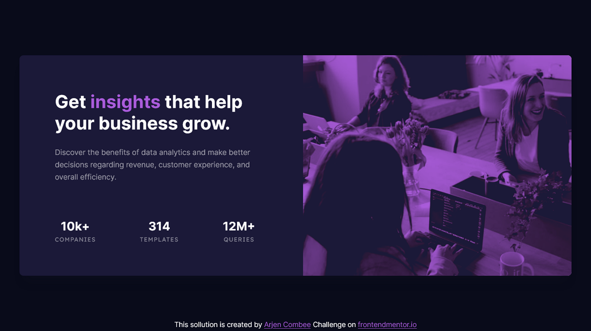

# Frontend Mentor - Stats preview card component solution

This is a solution to the [Stats preview card component challenge on Frontend Mentor](https://www.frontendmentor.io/challenges/stats-preview-card-component-8JqbgoU62). Frontend Mentor challenges help you improve your coding skills by building realistic projects.

## Table of contents

- [Frontend Mentor - Stats preview card component solution](#frontend-mentor---stats-preview-card-component-solution)
  - [Table of contents](#table-of-contents)
  - [Overview](#overview)
    - [The challenge](#the-challenge)
    - [Screenshot](#screenshot)
    - [Links](#links)
  - [My process](#my-process)
    - [Built with](#built-with)
    - [What I learned](#what-i-learned)
  - [Author](#author)
  - [Acknowledgments](#acknowledgments)

## Overview

### The challenge

Users should be able to:

- View the optimal layout depending on their device's screen size

### Screenshot

My desktop sollution for this challenge



### Links

- Solution URL: [GitHub - repository](https://github.com/ArCombee/FEM-REPOSITORY-2021/tree/main/FEM_03_STATS_PREVIEW_CARD/04_SHOWCASE)
- GitHub page: [GitHub - Pages](https://arcombee.github.io/fem/03_stats_preview)
- Live Site URL: [My personal site](https://arjencombee.nl/fem/03_stats_preview)

## My process

### Built with

- Semantic HTML5 markup
- CSS custom properties
- CSS Grid
- Flexbox
- Mobile-first workflow

### What I learned

Tried to keep HTML sematic, but still struglle with tag to use.

To give the picture a color overlay I used two blend mode properties.

```css
.card__image {
  background-image: url("../images/image-header-mobile.jpg");
  background-color: hsla(277, 64%, 61%, 1);
  mix-blend-mode: lighten;
  background-blend-mode: multiply;
  background-size: cover;
}
```

## Author

- Website - [arjencombee.nl](https://arjencombee.nl)
- Frontend Mentor - [@ArCombee](https://www.frontendmentor.io/profile/ArCombee)
- Twitter - [@ArjenCombee](https://twitter.com/ArjenCombee)

## Acknowledgments

Big shout-out to some people who really inspired me to lean web development. They are the reason why I joined [frontendmentor](https://www.frontendmentor.io/) to get better in coding and have a fun time doing so.

<span style="color:red">♥</span> [Brad Traversy](https://www.youtube.com/c/TraversyMedia)

<span style="color:red">♥</span> [Jonas Schmedtmann](https://codingheroes.io/)

<span style="color:red">♥</span> [Kevin Powell](https://www.youtube.com/kepowob)

<span style="color:red">♥</span> [Jessica Chan](https://www.youtube.com/c/TheCoderCoder)
