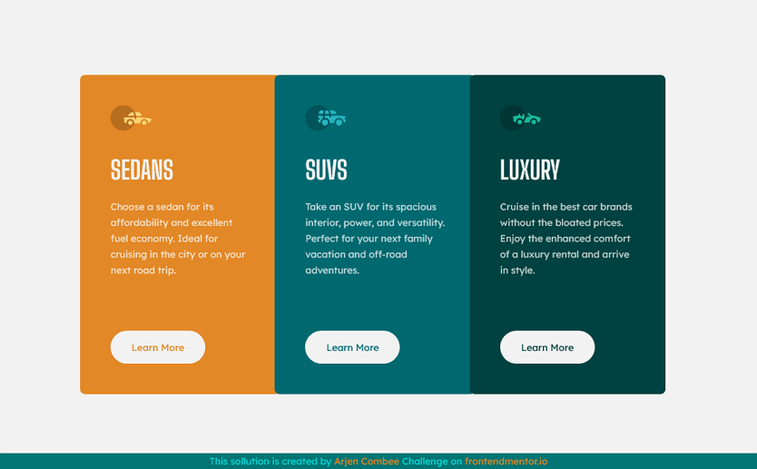

# Frontend Mentor - 3-column preview card component solution

This is a solution to the [3-column preview card component challenge on Frontend Mentor](https://www.frontendmentor.io/challenges/3column-preview-card-component-pH92eAR2-). Frontend Mentor challenges help you improve your coding skills by building realistic projects.

## Table of contents

- [Frontend Mentor - 3-column preview card component solution](#frontend-mentor---3-column-preview-card-component-solution)
  - [Table of contents](#table-of-contents)
  - [Overview](#overview)
    - [The challenge](#the-challenge)
    - [Screenshot](#screenshot)
    - [Links](#links)
  - [My process](#my-process)
    - [Built with](#built-with)
      - [Tools and applications](#tools-and-applications)
    - [What I learned](#what-i-learned)
    - [Continued development](#continued-development)
    - [Useful resources](#useful-resources)
  - [About the Author](#about-the-author)
  - [Acknowledgments](#acknowledgments)

## Overview

### The challenge

Users should be able to:

- View the optimal layout depending on their device's screen size
- See hover states for interactive elements

### Screenshot

Screenshot of my desktop sollution



### Links

- Solution URL: [GitHub - repository](https://github.com/ArCombee/FEM-REPOSITORY-2021/tree/main/FEM_04_3_COLUMN_PREVIEW/04_SHOWCASE)
- GitHub page: [GitHub - Pages](https://arcombee.github.io/fem/04_3column)
- Live Site URL: [My personal site](https://arjencombee.nl/fem/04_3column)

## My process

### Built with

- Semantic HTML5 markup
- CSS custom properties
- CSS Grid
- Flexbox
- Mobile-first workflow
- SVG-sprite

#### Tools and applications

- VSCode
- Mozzila Firefox Developer
- Google Chrome

### What I learned

In this challenge my focus was on getting the quality up level. Also search a way to combine the SVG-files into one file (sprite). This minimizes the request of the page, I think.

Sample code of sprite sollution in HTML code

```html
<svg class="card__icon card__icon--sedans">
  <use href="assets/images/sprite.vg#icon-sedans"></use>
</svg>
```

### Continued development

My struggle with the first challenges was: which semantic HTML tags must I use. On [Frontendmentor](https://www.frontendmentor.io) I did get some great feedback (thanks all!) on my sollutions. So I need to learn a lot more on development 😀.

### Useful resources

- [SVG Sprite generator](https://www.example.com) - This helped me for XYZ reason. I really liked this pattern and will use it going forward.

## About the Author

- Website - [arjencombee.nl](https://arjencombee.nl)
- Frontend Mentor - [@ArCombee](https://www.frontendmentor.io/profile/ArCombee)
- Twitter - [@ArjenCombee](https://twitter.com/ArjenCombee)

## Acknowledgments

---

🌟SPECIAL THANKS TO 🌟

[**Grace**](https://www.frontendmentor.io/profile/grace-snow) on Frontendmentor.

I recieved some great feedback on previous challenges.

---

Big shout-out to some people who really inspired me to lean web development. They are the reason why I joined [frontendmentor](https://www.frontendmentor.io/) to get better in coding and have a fun time doing so.

<span style="color:red">♥</span> [Brad Traversy](https://www.youtube.com/c/TraversyMedia)

<span style="color:red">♥</span> [Jonas Schmedtmann](https://codingheroes.io/)

<span style="color:red">♥</span> [Kevin Powell](https://www.youtube.com/kepowob)

<span style="color:red">♥</span> [Jessica Chan](https://www.youtube.com/c/TheCoderCoder)
